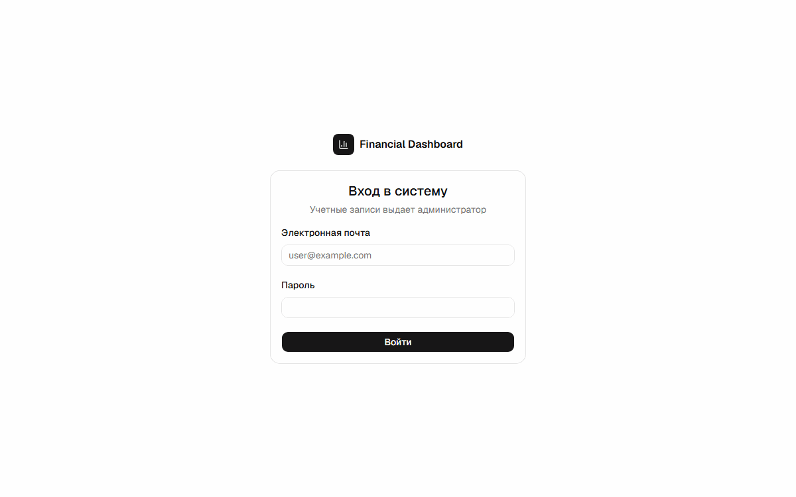
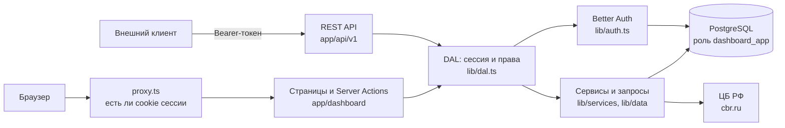

# Financial Dashboard

[](https://github.com/Fh192/financial-dashboard/actions/workflows/ci.yml)
[](https://qlty.sh/gh/Fh192/projects/financial-dashboard)

Панель учета счетов и клиентов: показатели и выручка по месяцам, счета с журналом статусов, справочник клиентов, пользователи с ролями, официальные курсы ЦБ РФ, выгрузка в CSV и REST API.

Проект сделан в рамках производственной практики (ПМ.02 и ПМ.11, специальность 09.02.07). Основа — туториал [Next.js Dashboard](https://nextjs.org/learn/dashboard-app) из каталога [project-based-learning](https://github.com/practical-tutorials/project-based-learning), доработанный до многопользовательского приложения.

**Демо:** https://financial-dashboard-sepia-eight.vercel.app



## Тестовые учетные записи

| Роль          | Почта               | Пароль      | Что доступно                                               |
| ------------- | ------------------- | ----------- | ---------------------------------------------------------- |
| Администратор | admin@example.com   | Admin123!   | Все, включая управление пользователями и удаление клиентов |
| Менеджер      | manager@example.com | Manager123! | Создание и изменение счетов и клиентов, удаление счетов    |
| Наблюдатель   | viewer@example.com  | Viewer123!  | Просмотр и выгрузка в CSV (выгрузка доступна всем ролям)   |

С одного IP можно сделать не больше 5 попыток входа в минуту, дальше сервер отвечает 429.

## Что добавлено к туториалу

| Доработка                                                                                   | Где в коде                                          |
| ------------------------------------------------------------------------------------------- | --------------------------------------------------- |
| Вход по паролю через Better Auth, сессии в БД, ограничение частоты попыток входа            | `lib/auth.ts`, `proxy.ts`                           |
| Роли admin / manager / viewer, проверка прав на каждой странице, в действиях и в API        | `lib/permissions.ts`, `lib/dal.ts`                  |
| Управление пользователями: создание, смена роли и пароля, блокировка, завершение сеансов    | `app/dashboard/users`, `lib/actions/users.ts`       |
| Полный CRUD клиентов и счетов с валидацией на zod и сообщениями на русском                  | `lib/validation`, `lib/services`                    |
| Журнал смены статусов счета, который ведет триггер БД                                       | `db/migrations/*_create_invoice_status_history.sql` |
| Курсы ЦБ РФ: XML с cbr.ru, резервное зеркало, кэш в БД, пересчет сумм в рубли               | `lib/cbr`, `lib/data/exchange-rates.ts`             |
| Выгрузка счетов и клиентов в CSV для Excel (с учетом поиска)                                | `lib/csv.ts`, `app/dashboard/*/export`              |
| REST API `/api/v1` с токеном Bearer и документацией OpenAPI 3.1                             | `app/api/v1`, `lib/api`                             |
| Схема БД на миграциях: внешние ключи, `CHECK`, уникальность, индексы, представление выручки | `db/migrations`                                     |
| Отдельный пользователь БД без права менять схему, тестовые данные, резервное копирование    | `db/create-user.ts`, `db/seed.ts`, `db/backup.ts`   |
| Юнит- и e2e-тесты, CI на GitHub Actions, автоматические миграции продакшена                 | `lib/**/*.test.ts`, `e2e`, `.github/workflows`      |

## Стек

| Слой            | Технологии                                                                                  |
| --------------- | ------------------------------------------------------------------------------------------- |
| Приложение      | Next.js 16 (App Router, Server Components, Server Actions), React 19, TypeScript            |
| Интерфейс       | shadcn/ui (Radix UI), Tailwind CSS 4, Recharts, lucide-react, sonner                        |
| База данных     | PostgreSQL 17/18, драйвер `pg` без ORM, миграции dbmate на SQL                              |
| Авторизация     | Better Auth: пароли (scrypt), плагины admin и bearer                                        |
| Валидация и API | zod 4, zod-openapi, Scalar (документация API)                                               |
| Тесты           | Vitest, Testing Library, Playwright                                                         |
| Качество кода   | ESLint, Prettier, Qlty                                                                      |
| Инфраструктура  | Vercel (регион fra1), Neon (PostgreSQL 18), GitHub Actions, Docker Compose для локальной БД |

## Архитектура



- `proxy.ts` только отправляет на страницу входа запросы без cookie сессии. Сама сессия и права проверяются на сервере в `lib/dal.ts` перед каждым чтением и изменением данных.
- Server Actions (формы интерфейса) и REST API вызывают одни и те же функции из `lib/services`, поэтому правила проверки у них общие.
- Приложение подключается к БД пользователем с ролью `dashboard_app`: он может читать и менять данные, но не может менять схему и писать в журнал статусов. Журнал ведет триггер с правами владельца.
- Курсы ЦБ запрашиваются один раз за дату и сохраняются в таблицу `exchange_rates`. Если cbr.ru не отвечает, используется зеркало cbr-xml-daily.ru.

Модель данных (ERD), права ролей БД и работа с резервными копиями описаны в [db/README.md](db/README.md).

```
app/            страницы, Server Actions, REST API (app/api/v1), документация API (app/api/docs)
components/     интерфейс: ui/ — компоненты shadcn, остальное — компоненты разделов
lib/            авторизация, права, доступ к данным, сервисы, валидация, клиент ЦБ, CSV
db/             миграции, тестовые данные, создание пользователя БД, бэкап и восстановление
e2e/            сценарии Playwright
.github/        CI и ручной сброс демо-данных
```

## Локальный запуск

Нужны Node.js 22+, pnpm (`corepack enable`) и Docker.

```bash
git clone https://github.com/Fh192/financial-dashboard.git
cd financial-dashboard
pnpm install

docker compose up -d          # PostgreSQL 17 на localhost:5433
cp .env.example .env          # затем заполнить POSTGRES_URL и BETTER_AUTH_SECRET

pnpm db:migrate               # схема БД
pnpm db:seed                  # тестовые пользователи, 10 клиентов, 50 счетов
pnpm db:create-user           # пользователь приложения; строку подключения записать в POSTGRES_URL

pnpm dev                      # http://localhost:3000
```

### Переменные окружения

| Переменная           | Для чего                                                                                        |
| -------------------- | ----------------------------------------------------------------------------------------------- |
| `DATABASE_URL`       | Владелец БД. Нужен только для миграций, тестовых данных и бэкапов, приложение его не использует |
| `POSTGRES_URL`       | Пользователь приложения с ролью `dashboard_app` (выдает `pnpm db:create-user`)                  |
| `BETTER_AUTH_SECRET` | Секрет подписи сессий, не короче 32 символов: `openssl rand -base64 32`                         |
| `BETTER_AUTH_URL`    | Адрес приложения. Локально `http://localhost:3000`, на Vercel определяется сам                  |

## Команды

| Команда                                         | Что делает                                             |
| ----------------------------------------------- | ------------------------------------------------------ |
| `pnpm dev` / `pnpm build` / `pnpm start`        | Режим разработки, сборка, запуск собранного приложения |
| `pnpm lint` / `pnpm typecheck` / `pnpm format`  | ESLint, проверка типов, Prettier                       |
| `pnpm test` / `pnpm test:coverage`              | Юнит-тесты Vitest, с покрытием                         |
| `pnpm test:e2e`                                 | Сценарии Playwright (сами запускают приложение)        |
| `pnpm db:migrate` / `db:rollback` / `db:status` | Миграции                                               |
| `pnpm db:seed` / `db:reset`                     | Добавить тестовые данные / очистить и заполнить заново |
| `pnpm db:create-user`                           | Создать пользователя приложения или сменить ему пароль |
| `pnpm db:backup` / `db:restore <файл> --yes`    | Резервная копия и восстановление                       |

## REST API

Документация: [/api/docs](https://financial-dashboard-sepia-eight.vercel.app/api/docs), спецификация: [/api/openapi.json](https://financial-dashboard-sepia-eight.vercel.app/api/openapi.json).

| Метод и путь                                | Что делает                                 |
| ------------------------------------------- | ------------------------------------------ |
| `GET, POST /api/v1/invoices`                | Список счетов (поиск, страницы) и создание |
| `GET, PATCH, DELETE /api/v1/invoices/{id}`  | Счет по id, изменение, удаление            |
| `GET /api/v1/invoices/{id}/history`         | Журнал статусов счета                      |
| `GET, POST /api/v1/customers`               | Список клиентов и создание                 |
| `GET, PATCH, DELETE /api/v1/customers/{id}` | Клиент по id, изменение, удаление          |
| `GET /api/v1/summary`                       | Показатели и выручка по месяцам            |
| `GET /api/v1/exchange-rates`                | Курсы ЦБ РФ на дату                        |
| `GET /api/v1/me`                            | Текущий пользователь и его роль            |

Токен выдается при входе в заголовке ответа `set-auth-token`:

```bash
TOKEN=$(curl -si https://financial-dashboard-sepia-eight.vercel.app/api/auth/sign-in/email \
  -H "Content-Type: application/json" \
  -d '{"email":"viewer@example.com","password":"Viewer123!"}' \
  | grep -i '^set-auth-token:' | cut -d' ' -f2 | tr -d '\r')

curl https://financial-dashboard-sepia-eight.vercel.app/api/v1/summary -H "Authorization: Bearer $TOKEN"
```

Ошибки возвращаются в едином формате с кодами 400, 401, 403, 404, 409, 415 и 422.

## Тесты и CI

- **Юнит-тесты (Vitest):** права ролей, валидация, парсинг и пересчет курсов ЦБ, CSV, форматирование, обработка ошибок БД, безопасные редиректы.
- **E2E (Playwright):** вход и выход, ограничения по ролям, панель, полный цикл счета и клиента, выгрузка CSV, REST API.
- **GitHub Actions** ([ci.yml](.github/workflows/ci.yml)) на каждый пуш и pull request:
  1. ESLint, проверка типов, юнит-тесты с покрытием (покрытие уходит в Qlty);
  2. сборка и e2e-тесты на чистом PostgreSQL 18;
  3. после двух зеленых шагов, только в ветке `main`: миграции продакшен-БД.

## Деплой

- Приложение — Vercel, регион fra1 (Франкфурт), рядом с базой.
- База — Neon, PostgreSQL 18, Франкфурт. На Vercel заданы только `POSTGRES_URL` (пользователь приложения через пулер соединений) и `BETTER_AUTH_SECRET`.
- Строка подключения владельца БД хранится в секрете GitHub `PRODUCTION_DATABASE_URL`. По ней CI применяет миграции, в Vercel ее нет.
- Если проверяющие изменили демо-данные, их можно вернуть: Actions → «Продакшен-БД» → Run workflow → `reset` ([production-db.yml](.github/workflows/production-db.yml)).
