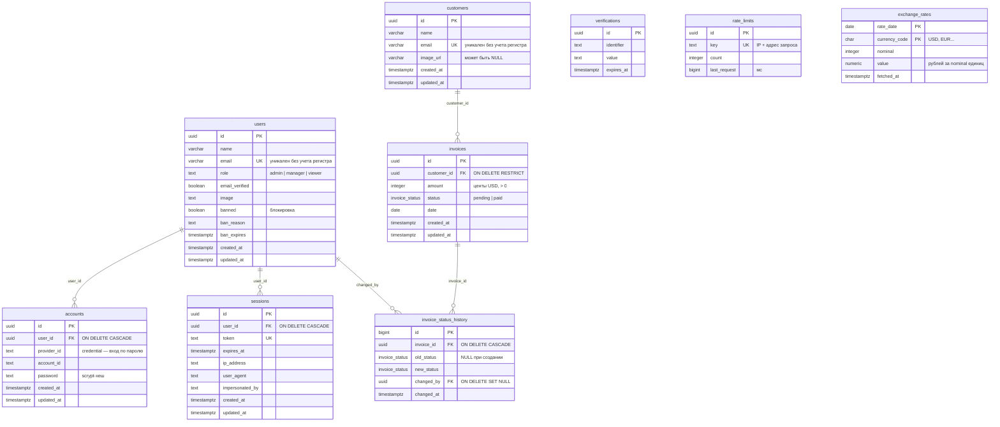

# База данных

PostgreSQL 17. Схема описана миграциями [dbmate](https://github.com/amacneil/dbmate) на чистом SQL в `db/migrations/`. Приложение работает с базой через драйвер `pg` без ORM. Авторизация — [Better Auth](https://www.better-auth.com/) (`lib/auth.ts`), его таблицы тоже создаются миграциями.

## Модель данных



| Объект | Назначение |
|---|---|
| `users` | Пользователи системы, их роли и блокировка |
| `sessions` | Сессии пользователей. Удаление строки завершает сессию |
| `accounts` | Способы входа. Для входа по почте — `provider_id = 'credential'` и хеш пароля |
| `verifications` | Одноразовые токены (сброс пароля, подтверждение почты) |
| `rate_limits` | Счетчики ограничения частоты запросов к API авторизации |
| `customers` | Клиенты, которым выставляются счета |
| `invoices` | Счета клиентов |
| `invoice_status_history` | Журнал смены статусов счетов. Заполняется только триггером `invoices_log_status_change` |
| `exchange_rates` | Кэш официальных курсов ЦБ РФ |
| `revenue` (представление) | Выручка по месяцам за последние 12 месяцев, считается из оплаченных счетов |

Целостность обеспечивает сама база: внешние ключи, `CHECK` (сумма больше нуля, формат почты, непустое имя, допустимые роли), перечисление статусов счета, уникальность почты без учета регистра. Поле `updated_at` обновляет триггер `set_updated_at`.

## Локальный запуск

```bash
docker compose up -d        # PostgreSQL 17 на localhost:5433
cp .env.example .env        # указать DATABASE_URL локальной базы
pnpm db:migrate             # применить миграции
pnpm db:seed                # тестовые данные
pnpm db:create-user         # пользователь приложения, строку подключения записать в POSTGRES_URL
```

## Команды

| Команда | Что делает |
|---|---|
| `pnpm db:migrate` | Применяет новые миграции |
| `pnpm db:rollback` | Откатывает последнюю миграцию |
| `pnpm db:status` | Показывает, какие миграции применены |
| `pnpm db:new <имя>` | Создает файл новой миграции |
| `pnpm db:seed` | Добавляет тестовые данные. Повторный запуск ничего не дублирует |
| `pnpm db:reset` | Очищает таблицы и заполняет тестовыми данными заново |
| `pnpm db:create-user [--readonly] [--name <имя>]` | Создает пользователя с правом входа или меняет ему пароль |
| `pnpm db:backup` | Создает резервную копию в `backups/` |
| `pnpm db:restore <файл> --yes` | Восстанавливает базу из резервной копии |

Все команды подключаются по `DATABASE_URL` (владелец базы) из `.env` или из окружения.

## Тестовые учетные записи

Создаются командой `pnpm db:seed`.

| Почта | Пароль | Роль |
|---|---|---|
| admin@example.com | Admin123! | admin |
| manager@example.com | Manager123! | manager |
| viewer@example.com | Viewer123! | viewer |

## Роли и права доступа

Приложение не подключается к базе под владельцем. Миграция `create_app_roles` создает групповые роли без права входа, а пользователи для входа создаются командой `pnpm db:create-user` и получают одну из этих ролей. Пароли в репозиторий не попадают.

| Право | Владелец (`DATABASE_URL`) | `dashboard_app` (приложение) | `dashboard_readonly` (отчеты) |
|---|---|---|---|
| Создание и изменение таблиц (DDL) | да | нет | нет |
| `users` | все | все операции с данными | чтение без служебных полей блокировки |
| `sessions`, `accounts`, `verifications`, `rate_limits` | все | все операции с данными | нет доступа |
| `customers`, `invoices` | все | все операции с данными | чтение |
| `exchange_rates` | все | чтение, добавление, изменение | чтение |
| `invoice_status_history` | все | только чтение | чтение |
| `revenue` | все | чтение | чтение |

Журнал статусов нельзя подделать через приложение: у `dashboard_app` нет права `INSERT` в него. Запись делает триггерная функция с `SECURITY DEFINER`, которая выполняется с правами владельца. Автора изменения приложение передает внутри транзакции:

```sql
SELECT set_config('app.user_id', '<uuid пользователя>', true);
UPDATE invoices SET status = 'paid' WHERE id = '<uuid счета>';
```

## Резервное копирование и восстановление

```bash
pnpm db:backup                                   # backups/<база>_<дата>_<время>.dump
pnpm db:restore backups/<файл>.dump --yes        # восстановление
```

- Копия создается через `pg_dump` в формате custom (`-Fc`): сжатая, можно восстановить целиком или отдельные таблицы.
- Если `pg_dump` и `pg_restore` нет в `PATH`, скрипты запускают их в Docker-образе `postgres:17-alpine`. Другой образ задается переменной `PG_IMAGE`.
- Восстановление идет одной транзакцией (`--single-transaction`): при ошибке база остается в прежнем состоянии. Без флага `--yes` скрипт ничего не делает.
- Роли кластера в копию не входят. Перед восстановлением в новую базу нужно применить миграцию с ролями или создать роли `dashboard_app` и `dashboard_readonly` вручную.
- На Neon, кроме ручных копий, есть восстановление на момент времени (point-in-time restore) в настройках проекта.

## Neon (продакшен)

- `DATABASE_URL` — прямой адрес владельца без пулера (`DATABASE_URL_UNPOOLED` в Vercel). Миграции и бэкапы запускайте по нему, а не через пулер.
- `POSTGRES_URL` — строка из `pnpm db:create-user`. Для Vercel лучше адрес пулера: к первой части хоста добавить `-pooler`.
- Драйвер `pg` считает `sslmode=require` синонимом `verify-full` и пишет об этом предупреждение. Чтобы его не было, в адресах Neon замените `sslmode=require` на `sslmode=verify-full`.
